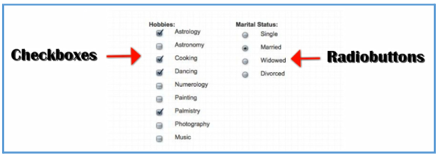
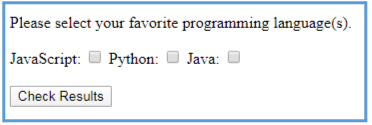

# JS Checkboxes and Radio Buttons



## Table of Contents

- [Checkboxes](#checkboxes)
  - [Check1.html](#check1html)
  - [check2.html](#check2html)
  - [check3.html](#check3html)
  - [check4.html](#check4html)
  - [CheckBoxProblem.html (Task)](#checkboxproblemhtml-task)
- [Radio Buttons](#radio-buttons)
  - [Radio1.html](#radio1html)
  - [RadioPassportProblem.html](#radiopassportproblemhtml-task)

## Checkboxes

### [Check1.html](check1.html)

As you can see from the code below, a checkbox has a **.checked** property. When it's true, the box has a check in it. When the **.checked** property is false, it is not checked. So, the program above basically just checks a checkbox when you click on the **Check Checkbox** button and unchecks the checkbox when you click on the **Uncheck Checkbox** button.

```html
<!DOCTYPE html>
<html lang="en" dir="ltr">
  <head>
    <meta charset="utf-8" />
    <title>Checkbox Example 1</title>
    <script>
      function check() {
        document.querySelector(".myCheck").checked = true;
      }
      function uncheck() {
        document.querySelector(".myCheck").checked = false;
      }
    </script>
  </head>
  <body>
    Checkbox: <input type="checkbox" class="myCheck" name="" value="" />
    <button type="button" name="button" onClick="check()">
      Check Checkbox
    </button>
    <button type="button" name="button" onClick="uncheck()">
      Uncheck Checkbox
    </button>
  </body>
</html>
```

### [check2.html](check2.html)

In the program below, the function checks the state of the checkbox and stores it in a variable called **isChecked**. The value of this variable is going to be true or false because it is a Boolean value. The conditional statement checks to see if the Boolean **isChecked == true**. If it is, the checkbox is checked. If the value of **isChecked** is NOT true, it is false and that means it is not checked.

```html
<!DOCTYPE html>
<html lang="en" dir="ltr">
  <head>
    <meta charset="utf-8" />
    <title>Checkbox Example 2</title>
    <script>
      function check() {
        let isChecked = document.querySelector(".myCheck").checked;
        if (isChecked == true) {
          document.querySelector(".demo").textContent =
            isChecked + " so CheckBox is checked";
        } else {
          document.querySelector(".demo").textContent =
            isChecked + " so CheckBox is NOT checked";
        }
      }
    </script>
  </head>
  <body>
    Checkbox: <input type="checkbox" class="myCheck" name="" value="" />
    <button type="button" name="button" onClick="check()">Try It</button>
    <p>
      Click the "Try It" button to find out whether the checkbox is checked, or
      not.
    </p>
    <p class="demo"></p>
  </body>
</html>
```

### [check3.html](check3.html)

This program activates some other part of the screen when a checkbox is checked. When the checkbox is unchecked, the material that was displayed disappears. It could be used to display images, sections of forms could appear and disappear etc. When the program initially starts, a style is set (**#text**) that sets the display to none for the paragraph (**display: none;**), so the text "Checkbox is CHECKED" does not appear on the screen. When the checkbox is checked, the **onclick** event calls a function called **check()**. This function checks to see if the checkbox is checked. If it is checked, it sets the display property of the paragraph with an **id="text"** to block with the code **text.style.display = "block"**.

Here is the output:


A block element fills the entire line and nothing can be displayed on its right or left side. You can test this by typing your first name before the paragraph tags and your last name after the paragraph tags in the code, then running the program and checking the checkbox. The text "Checkbox is CHECKED" will appear on its own line with nothing on the left or right side of it.

```html
<!DOCTYPE html>
<html lang="en" dir="ltr">
  <head>
    <meta charset="utf-8" />
    <title>Checkbox Example 3</title>
    <script>
      function check() {
        if (document.querySelector(".chkbox").checked == true) {
          document.querySelector(".text").style.display = "block";
          // a block element fills the entire line and nothing can be displayed on it's right or left side.
        } else {
          document.querySelector(".text").style.display = "none";
          // element will not be displayed on the screen
        }
      }
    </script>
    <style>
      .text {
        display: none;
      }
    </style>
  </head>
  <body>
    Checkbox:
    <input type="checkbox" class="chkbox" onClick="check()" name="" value="" />
    <p>This program displays some text when a checkbox is checked.</p>
    <p class="text">Checkbox is CHECKED!</p>
  </body>
</html>
```

### [check4.html](check4.html)

We are now going to program a small program that has a checkbox that turns the screen black when it is checked, and white when it is unchecked. We will simulate turning a light switch on and off!

The initial screen will look like this:


And when the checkbox is clicked, the lights go out!


```html
<!DOCTYPE html>
<html lang="en" dir="ltr">
  <head>
    <meta charset="utf-8" />
    <title>Checkbox Example 4</title>
    <script>
      function lights() {
        //need code here
      }
    </script>
  </head>
  <body>
    <form>
      Light Switch:
      <input
        type="checkbox"
        id="lightChkBox"
        onClick="lights()"
        name=""
        value=""
      />
    </form>
  </body>
</html>
```

### [CheckBoxProblem.html (Task)](CheckBoxProblem.html)

You are going to create a program that looks like this in the browser:



When the user chooses their favorite programming language(s), they will receive an alert (or alerts) telling them which languages they like. The output will look like this (if they choose JavaScript and Python):


**Note:** Adding a Reset button with type “reset” to the form will allow the user to have all checkboxes unchecked.

## Radio Buttons

Note that all the radio buttons have the same "**name**" that way they form a group where only one button can be chosen ... pick one the other ones are unchosen

Now we are going to create a program with radio buttons. With radio buttons, only one button can be chosen at any one time. If you try to choose two, the first choice becomes undone. In the code for each radio button you will see this: **onclick="choice(this.value)"**. When you click on the radio button it calls a function called **choice**. This function is passed (an argument) the value of the radio button. In the line of code below, the value of this radio button is **Firefox**. Each radio button has a different value.

```html
<input
  type="radio"
  onclick="choice(this.value)"
  name="browser"
  value="Firefox"
/>Firefox<br />
```

### [radio1.html](radio1.html)

```html
<!DOCTYPE html>
<html lang="en" dir="ltr">
  <head>
    <meta charset="utf-8" />
    <title>Radio Button Example</title>
    <script>
      function choice(davalue) {
        document.querySelector(".dachoice").value = davalue;
      }
    </script>
    <style>
      p {
        font-weight: 900;
        color: #0000ff;
        text-transform: uppercase;
        font-size: 18px;
      }
      .dachoice {
        font-weight: 600;
        color: #0000ff;
        font-size: 14px;
      }
      .dacolor {
        font-size: 18px;
        color: red;
        font-weight: 500;
      }
    </style>
  </head>
  <body>
    <p>Please choose your favorite browser.</p>
    <form>
      <input
        type="radio"
        onclick="choice(this.value)"
        name="browser"
        value="Firefox"
      /><span class="dacolor">Firefox</span><br />
      <input
        type="radio"
        onclick="choice(this.value)"
        name="browser"
        value="Chrome"
      /><span class="dacolor">Chrome</span><br />
      <input
        type="radio"
        onclick="choice(this.value)"
        name="browser"
        value="Safari"
      /><span class="dacolor">Safari</span><br /><br />
      <input type="text" name="" class="dachoice" value="" />
    </form>
  </body>
</html>
```

### [RadioPassportProblem.html (task)](RadioPassportProblem.html)

You are going to create a program that looks like this when it is first loaded into the browser:


When the user clicks the **Yes** radio button, this appears in the browser:


If the user clicks the **No** radio button, the objects below the horizontal line disappear again:


All the text, (including the Yes and No text in the radio buttons) the horizontal line and the text box should be blue in color.

- Notes:

  - To make one of the radio buttons checked by **default**, put the word checked in the html.

    ```html
    <input
      type="radio"
      onclick="choice(this.value)"
      name="passport"
      value="No"
      checked
    />
    ```

  - For style, create a css class with the blue text and blue border attributes. Assign this class to every html element that you want to be coloured blue:

    ```css
    .colour {
      font-size: 15px;
      color: blue;
      font-weight: bold;
      border-color: blue;
    }
    ```
